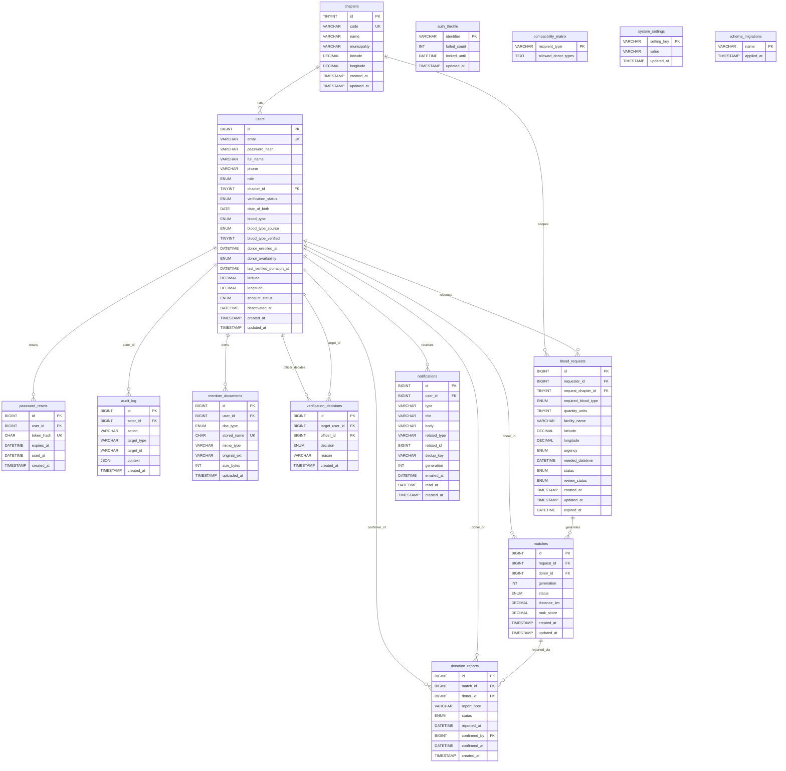

# BloodMatch — Entity Relationship Diagram (ERD) — Implemented Schema

> **Source of truth:** `database/migrations/001–014` applied to `bloodmatch_dev` (MariaDB 10.4 / XAMPP, port 3307). Verified **2026-08-27** via `SHOW CREATE TABLE`, `INFORMATION_SCHEMA.KEY_COLUMN_USAGE` and `database/run_migrations.php` (14 applied, re-run 0). Previous `docs/erd.md` documented 001–013 with ASCII sketch; this revision corrects to the **current** 001–014 schema with accurate Mermaid, keys and constraints.

---

## Short ERD Explanation

The Entity Relationship Diagram of BloodMatch shows the main entities and how they are connected in the system. It includes users, chapters, blood requests, matches, donation reports, notifications, verification documents, audit logs and supporting reference data. Information is linked through primary keys, foreign keys with defined actions, unique constraints, CHECK constraints and append-only triggers, reflecting the actual implemented database.

---

## ERD (Mermaid) — Current Implemented Schema

> **Mermaid rendering:** paste the block into https://mermaid.live or run `npx @mermaid-js/mermaid-cli -i docs/erd.md -o docs/erd.svg` to regenerate `docs/erd.svg` / `docs/erd.png`. The diagram is layout-grouped: *Identity/Access* (chapters/users/password_resets/auth_throttle), *Verification* (member_documents/verification_decisions), *Request/Matching* (blood_requests/compatibility_matrix/matches), *Donation* (donation_reports/system_settings), *Notifications/Auditing* (notifications/audit_log). Grouping is visual only.

---

## Entity Descriptions

**chapters**
Fixed reference data for the 3 Bataan chapters (Mt. Samat — Orani, Mt. Tarak — Mariveles, Meridian Heights — Balanga City). Seeded once via `001_chapters.sql` with `ON DUPLICATE KEY UPDATE`; not admin-manageable.

**users**
Stores member, Chapter Officer and System Administrator accounts, including email (login identity), password hash, role, chapter assignment, verification and account status, blood type and provenance, donor enrollment and availability, last verified donation time, coordinates and timestamps.

**password_resets**
Stores hashed single-use reset tokens (`token_hash` CHAR(64) SHA-256 hex, `expires_at` ~30 min, `used_at` for single-use) linked to a user.

**audit_log**
Immutable append-only trail of security and operational events (`actor_id`, `action`, polymorphic `target_type`/`target_id`, `context` JSON, millisecond `created_at`). Updates and deletes are blocked by database triggers.

**auth_throttle**
Counts failed login/reset attempts per `identifier` (`login:<email>` / `reset:<email>`) and locks the identifier until `locked_until` (5 fails / 15 min).

**member_documents**
Stores uploaded verification evidence (`national_id`, `donor_card`, `parental_consent`) with 64-hex random `stored_name` outside webroot, MIME type, original extension and size, linked to the owner.

**verification_decisions**
History of verification outcomes for a member (`target_user_id`) decided by an officer (`officer_id` nullable, SET NULL) with decision `verified`/`rejected`/`re_review_requested`/`resubmitted` and reason.

**blood_requests**
Stores blood requests with required blood type, quantity, facility name, urgency, needed datetime, status (`OPEN`/`FULFILLED`/`CANCELLED`/`EXPIRED`), review provenance (`pending_review` for pending creators), immutable `request_chapter_id` snapshot of the requestor's chapter, and optional coordinates.

**compatibility_matrix**
Standalone lookup of red-cell ABO/Rh compatibility: `recipient_type` PK (8 types) with CSV `allowed_donor_types`. No foreign keys; sole consumer is `BloodCompatibilityService`.

**matches**
Links a blood request to an eligible donor. One persistent row per `(request_id, donor_id)` unique pair with `generation`, status (`POTENTIAL`→`CLOSED`), Haversine `distance_km` and `rank_score` (Compatibility → Availability → Verification → Proximity).

**donation_reports**
Donor report of a completed donation linked canonically to `matches.id` (`match_id`) and to the donor; `confirmed_by` references the reviewing officer. Request is derived via `matches.request_id` — no duplicate column.

**system_settings**
Key-value store for administrative intervals, seeded `standby_hours=42`, `cooldown_days=90` via `INSERT IGNORE` (preserves overrides), validated by `SystemSettingsService`.

**notifications**
Per-user inbox entries with type, title, body, polymorphic `related_type`/`related_id`, `dedup_key` + `generation` (`UNIQUE`), and `emailed_at`/`read_at` timestamps.

**schema_migrations**
Runner bookkeeping (`name` PK, `applied_at`) managed by `database/run_migrations.php`; not domain data.

---

## Relationship Summary

- **One chapter has many users;** a user may belong to one chapter (admins may be `NULL`) — `users.chapter_id → chapters.id` `ON UPDATE CASCADE`.
- **One user has many password resets;** the same token hash is globally unique — `password_resets.user_id → users.id` `ON DELETE CASCADE`, `UNIQUE(token_hash)`.
- **One user (as actor) has many audit logs;** logs survive user deletion (`SET NULL`), target is polymorphic — `audit_log.actor_id → users.id`.
- **One user has many member documents;** document stored name is globally unique — `member_documents.user_id → users.id` `CASCADE`, `UNIQUE(stored_name)`.
- **One user (as member) has many verification decisions as target;** one user (as officer) has many decisions as reviewer (`SET NULL` on officer delete) — `verification_decisions.target_user_id`/`officer_id → users.id`.
- **One user has many blood requests as requester;** one chapter has many blood requests as immutable snapshot — `blood_requests.requester_id → users.id` `CASCADE`, `request_chapter_id → chapters.id`.
- **One blood request has many matches;** one user (as donor) has many matches — `matches.request_id → blood_requests.id`, `matches.donor_id → users.id`, `UNIQUE(request_id, donor_id)`.
- **One match has many donation reports;** one user (as donor) has many reports; one user (as confirmer) has many reports (`SET NULL`) — `donation_reports.match_id → matches.id`, `donor_id → users.id`, `confirmed_by → users.id`.
- **One user has many notifications;** related target is polymorphic — `notifications.user_id → users.id` `CASCADE`, `UNIQUE(dedup_key, generation)`.
- **Standalone lookup / settings:** `compatibility_matrix` (`recipient_type` PK) and `system_settings` (`setting_key` PK) have no foreign keys; `auth_throttle` (`identifier` PK) is independent (identifier encodes email, not a FK).
- **Polymorphic / logical references (no FK):** `audit_log.target_type/target_id`, `notifications.related_type/related_id`, `blood_requests.review_status` provenance (derived from `users.verification_status` at create time).

---

## Important Constraints & Notes

**Primary / Unique Keys:** All tables use `id` `BIGINT UNSIGNED AI` except `chapters.id` `TINYINT UNSIGNED AI`, `compatibility_matrix.recipient_type` `VARCHAR(3)`, `system_settings.setting_key` `VARCHAR(80)`, `auth_throttle.identifier` `VARCHAR(210)`, `schema_migrations.name`. Unique: `users.email`, `chapters.code`, `password_resets.token_hash`, `member_documents.stored_name`, `matches(request_id, donor_id)`, `notifications(dedup_key, generation)`.

**Foreign-Key Actions:** `ON DELETE CASCADE` for owned children (password resets, documents, decisions target, blood requests by requester, matches by request/donor, donation reports by match/donor, notifications by user); `ON DELETE SET NULL` for actor/reviewer references (audit actor, verification officer, donation confirmer) to preserve history; `ON UPDATE CASCADE` for chapter references.

**CHECK Constraints (InnoDB, verified via `SHOW CREATE TABLE` and `ERROR 4025` tests):**
- `chk_users_blood_type` / `chk_users_blood_source` / `chk_users_blood_verified` — blood type and provenance consistency.
- `chk_users_geo` / `chk_breq_geo` — latitude/longitude both-or-neither.
- `chk_users_deactivation` — `active` ↔ `deactivated_at IS NULL`, `deactivated` ↔ `NOT NULL`.
- `chk_cmatrix_type` — recipient_type in 8 ABO/Rh types.

**Triggers:** `audit_log_block_update` / `audit_log_block_delete` `BEFORE` triggers `SIGNAL 45000` enforce append-only (verified `UPDATE`/`DELETE` rejected).

**Indexes (beyond PK/FK):** `users` (`role`, `verification_status`, `account_status`, `donor_availability`), `password_resets` (`expires_at`), `audit_log` (`action`, `created_at`, `target_type,target_id`), `member_documents` (`user_id,doc_type`), `verification_decisions` (`target_user_id`, `officer_id`), `blood_requests` (`status`, `status+needed_datetime`, `urgency`), `matches` (`request_id,generation`, `status`, `donor_id`), `donation_reports` (`match_id`, `donor_id`, `status`), `notifications` (`user_id,read_at`, `type`). **014** adds composites `blood_requests(request_chapter_id, status, created_at)` and `audit_log(target_type, target_id, created_at)`.

**Polymorphic / Logical References (documented as non-FK):** `audit_log.target_type`/`target_id` (`VARCHAR(60/64)`, no FK) and `notifications.related_type`/`related_id` (`VARCHAR(40)`/`BIGINT UNSIGNED`, `NULL`, no FK) are application-level polymorphic pointers; do not draw as FK in the ERD.

**Seeder Idempotency:** `001_chapters.sql` (`ON DUPLICATE KEY UPDATE`) and `003_system_settings.sql` (`INSERT IGNORE`) keep fixed reference data at 3 chapters and 2 settings.

**Timestamps:** App writes UTC strings; PDO `time_zone='+00:00'`; `created_at`/`updated_at` `TIMESTAMP` (`audit_log`/`notifications`/`verification_decisions` `TIMESTAMP(3)` millisecond), `expired_at`/`reported_at` `DATETIME`.

---

## Schema Verification

- **Tables verified:** 14 `INFORMATION_SCHEMA.TABLES` rows in `bloodmatch_dev`: `audit_log`, `auth_throttle`, `blood_requests`, `chapters`, `compatibility_matrix`, `donation_reports`, `matches`, `member_documents`, `notifications`, `password_resets`, `schema_migrations`, `system_settings`, `users`, `verification_decisions` — 13 domain + 1 bookkeeping. All 13 domain tables match migrations 001–013 (plus 014 indexes).
- **Relationships verified (14 FKs):** via `SHOW CREATE TABLE` and `INFORMATION_SCHEMA.KEY_COLUMN_USAGE` — listed above — all `CASCADE`/`SET NULL` actions as documented.
- **Polymorphic / logical references:** 2 pairs (`audit_log` target, `notifications` related) verified as non-FK `VARCHAR`/`BIGINT` nullable, no constraints.
- **Discrepancies between previous `docs/erd.md` and actual schema:** previous file documented only `001–013` with ASCII sketch (`chapters ──< users ──< password_resets`...), omitted `system_settings`/`notifications` details in diagram, omitted 014 composites, and used descriptive rather than exact `SHOW CREATE` types/collations. Corrected here to full `001–014` with exact types, FK actions, CHECKs, triggers and Mermaid.
- **Live checks:** `D:\xampp\mysql\bin\mysql.exe -h 127.0.0.1 -P 3307 -u root -N -B -e "SHOW CREATE TABLE users\G"` / `KEY_COLUMN_USAGE` / `run_migrations.php` re-run 0 applied; FK violation → `ERROR 1452`, CHECK violation → `ERROR 4025`, audit `UPDATE`/`DELETE` → `ERROR 45000` as expected.

---

## Files Changed

- `docs/erd.md` — replaced ASCII overview with complete 001–014 Mermaid ERD, precise column types/keys/FK actions, full entity/relationship/constraints documentation.
- *(Optional rendered)* `docs/erd.svg` / `docs/erd.png` — generate via `npx @mermaid-js/mermaid-cli -i docs/erd.md -o docs/erd.svg` (Mermaid Live Editor paste of the block above produces identical output). No application code or database schema was modified.

