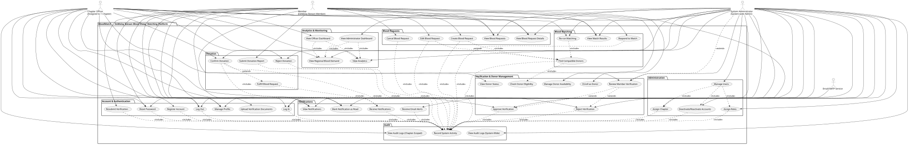

# BloodMatch — Use Case Diagram

## A. Short Use Case Diagram Explanation

The Use Case Diagram of BloodMatch illustrates how DeMolay members, Chapter Officers, and System Administrators interact with the blood donor matching platform. It presents the core functions of the implemented system: account registration and authentication, member profile and document management, officer-led identity verification, explicit donor enrollment with availability controls, blood request creation and lifecycle management, automated red-cell compatibility matching with proximity ranking, donor response and donation reporting, officer-confirmed donation workflow triggering standby/cooldown rules, in-app and email notifications with deduplication, chapter-scoped and system-wide audit logging, and operational dashboards with regional demand visualization and analytics.

---

## B. Actor List

| Actor | Role | Description |
|-------|------|-------------|
| **Member** | DeMolay Bataan Member | A registered member who can create an account, manage their profile, upload verification documents, submit blood requests, enroll as a voluntary donor, manage donor availability, view and respond to compatible donor matches, submit donation reports, and receive notifications. Access is gated by verification status per the capability matrix (CONTEXT.md §9.2). |
| **Chapter Officer** | Officer (1 Chapter) | An authenticated user with `officer` role assigned to exactly one of the three fixed chapters (Mt. Samat, Mt. Tarak, Meridian Heights). Can review and decide on member verifications within their chapter, confirm/reject donation reports for requests in their chapter, view chapter-scoped blood requests and matches, re-run matching for active requests, view chapter-scoped audit logs, analytics, demand map, and the officer dashboard triage queues. Cannot access other chapters' data or perform system-wide administration. |
| **System Administrator** | System-wide Admin | An authenticated user with `admin` role. Has system-wide access to manage users (assign roles, assign chapters, deactivate/reactivate accounts), override verification decisions, confirm/reject donations across all chapters, view all audit logs, system-wide analytics, demand map, and the administrator dashboard with cross-chapter comparative metrics. Cannot verify themselves or modify their own role/chapter/status. |
| **Email/SMTP Service** | External Service | External mail transport used by BloodMatch to deliver email alerts for critical events (verification decisions, match notifications, request/account status changes, donation confirmations). Invoked by the system's `Mailer.php` service (PHPMailer) with rate limiting (5 emails/user/hour, critical urgency bypass). Best-effort synchronous delivery; failures are logged but do not block in-app notifications. |

---

## C. Complete Use Case List

### Account & Authentication
1. **Register Account** — Allows a DeMolay member to create an account with personal, chapter, and blood-related information. Creates user with `verification_status='pending'`, `account_status='active'`, `role='member'`.
2. **Log In** — Allows registered users to securely authenticate using email and password. Establishes HttpOnly session cookie with regeneration; enforces rate limiting (5 failed attempts = 15 min lockout).
3. **Log Out** — Destroys server session and clears session cookie; records audit event.
4. **Reset Password** — Allows users to request a single-use, hashed reset token (30-minute expiry) and set a new password. Token stored as SHA-256 hash; single-use enforced via `used_at` timestamp.
5. **Manage Profile** — Allows authenticated users to update permitted fields (full name, phone, date of birth, self-reported blood type, coordinates). Explicitly rejects attempts to modify role, verification status, email, password, or blood_type_verified.
6. **Upload Verification Documents** — Allows users to upload identity documents (national ID, donor card, parental consent) with server-side MIME validation (JPEG/PNG/WEBP/PDF ≤5 MB), randomized storage outside webroot.
7. **Resubmit Verification** — Allows rejected members to resubmit for verification review (requires national ID document); transitions `verification_status` from `rejected` to `pending`.

### Verification & Donor Management
8. **Review Member Verification** — Allows Chapter Officers (own chapter) and System Admins (scope-exempt) to inspect pending member submissions, documents, age eligibility, and verification history.
9. **Approve Verification** — Allows authorized officers/admins to approve a pending member; optionally upgrades blood type provenance to `donor_card` (officer-verified) with mandatory non-medical disclaimer.
10. **Reject Verification** — Allows authorized officers/admins to reject a pending member with a recorded reason; member may resubmit.
11. **Enroll as Donor** — Allows verified members (age-eligible: ≥18, or 16–17 with parental consent) to explicitly opt in as a volunteer blood donor. Sets `donor_enrolled_at` and `donor_availability='available'`.
12. **Manage Donor Availability** — Allows enrolled donors to toggle availability (`available` ↔ `unavailable`). Blocked during system-enforced Standby (42-hour post-donation) or Cooldown (90-day inter-donation) windows.
13. **Check Donor Eligibility** — (System-internal) Verifies donor eligibility for matching: verified status, active account, explicit enrollment, `available` status, age consent, and no active standby/cooldown windows anchored to `last_verified_donation_at`.
14. **View Donor Status** — Allows members to view their own donor enrollment status, availability, and any active standby/cooldown remaining time.

### Blood Requests
15. **Create Blood Request** — Allows authenticated members (including pending verification — request marked `review_status='pending_review'`) to create a request with required blood type, quantity, facility, urgency, needed date/time, and coordinates. Automatically triggers matching engine and notifies compatible donors.
16. **View Blood Requests** — Allows members to list their own requests; officers/admins to view requests in their scope.
17. **View Blood Request Details** — Allows request owner, matched donors, chapter officers (own chapter), and admins to view full request details.
18. **Edit Blood Request** — Allows request owner to update facility, needed date/time, units, or urgency while request is `OPEN`. Material changes (blood type, location, urgency, needed date, quantity) trigger matching re-evaluation.
19. **Cancel Blood Request** — Allows request owner to cancel an `OPEN` request; status becomes `CANCELLED`, open matches closed.

### Blood Matching
20. **Find Compatible Donors** — (System-internal) Automatically executed on request creation and material changes. Uses centralized red-cell ABO/Rh compatibility matrix (8 types), filters to verified/enrolled/available/age-eligible donors, ranks by Compatibility → Availability → Verification → Proximity (Haversine distance) with same-chapter preference boost. Generates persistent `matches` rows with generation number.
21. **View Match Results** — Allows request owner, matched donors, chapter officers, and admins to view anonymized candidate donors (`Donor #ID`, chapter, verification/availability status, approximate distance). Chapter display filter optional; never alters underlying match set.
22. **Re-run Matching** — Allows authorized users (request owner, chapter officer, admin) to manually trigger match regeneration for an active request. Increments generation; reconciles existing matches without duplicates.
23. **Respond to Match** — Allows the matched donor to signal willingness to donate; transitions match status `POTENTIAL`/`NOTIFIED` → `RESPONDED`. Multiple donors may respond in parallel.

### Donation
24. **Submit Donation Report** — Allows the matched donor to submit a donation report (note) for officer confirmation; creates `donation_reports` row with `status='PENDING'`.
25. **Confirm Donation** — Allows chapter officer (own chapter) or admin to confirm a pending donation report. Executes atomic transaction: marks report `CONFIRMED`, match `COMPLETED`, sets donor `last_verified_donation_at`, activates Standby (42h) and Cooldown (90d), checks request fulfillment threshold (`quantity_units`).
26. **Reject Donation** — Allows chapter officer (own chapter) or admin to reject a pending donation report; marks report `REJECTED`.
27. **Fulfill Blood Request** — (System-internal) Automatically transitions request `OPEN` → `FULFILLED` when confirmed donation count reaches `quantity_units`; closes remaining matches to `CLOSED`.

### Notifications
28. **Receive Notifications** — (System-internal) Creates in-app notification records for events: new matches, verification decisions, donation confirmations/rejections, account status changes, request cancellation/expiration. Deduplication via unique `(dedup_key, generation)`.
29. **View Notifications** — Allows users to view paginated notification list with type/read filters; live unread count in header.
30. **Mark Notification as Read** — Allows users to mark single or all notifications as read (idempotent).
31. **Receive Email Alerts** — (External interaction) Delivers email for defined important events via SMTP; rate-limited (5/user/hr), critical urgency bypasses limit. Failures logged, never blocks in-app notification.

### Audit
32. **Record System Activity** — (System-internal) Append-only audit logging for 32+ mandatory event types (registration, login, verification decisions, request lifecycle, donation workflow, availability changes, role/chapter changes, admin overrides, cross-chapter authorizations). Database triggers enforce immutability (UPDATE/DELETE blocked).
33. **View Audit Logs (Chapter-Scoped)** — Allows Chapter Officers to query audit events relevant to their chapter (actor/target in chapter).
34. **View Audit Logs (System-Wide)** — Allows System Administrators to query all audit events with multi-parameter search.

### Analytics & Monitoring
35. **View Analytics** — Allows officers (chapter-scoped) and admins (system-wide, optional chapter filter) to view operational metrics: request volume/trends, resolution rates (fulfillment/cancellation/expiration against resolved denominator), blood type demand, urgency breakdown, daily trends, live donor eligibility breakdown, verification/donation activity.
36. **View Regional Blood Demand** — Allows officers (own chapter) and admins (all chapters) to view aggregated counts of active `OPEN` requests at chapter centroid level, grouped by blood type and urgency. Never exposes individual request locations or identities.
37. **View Officer Dashboard** — Allows Chapter Officers to view triage queues: pending verifications, pending donation confirmations, active open requests, donor pool summary, blood type demand, recent chapter activity.
38. **View Administrator Dashboard** — Allows System Administrators to view global KPIs, total users, 3-chapter comparative matrix, lifecycle resolution rates.

### Administration
39. **Manage Users** — Allows System Administrators to list all users system-wide with filters (role, status, chapter, search) and pagination.
40. **Assign Roles** — Allows System Administrators to assign `member`/`officer`/`admin` roles; officer role requires exactly one chapter assignment; self-role change forbidden.
41. **Assign Chapter** — Allows System Administrators to assign/clear user chapter binding; clearing an officer's chapter forbidden (422).
42. **Deactivate/Reactivate Accounts** — Allows System Administrators to soft-deactivate accounts (`account_status='deactivated'`, `deactivated_at` set) or reactivate; verification status untouched; deactivated sessions immediately denied access.

---

## D. Actor-to-Use-Case Relationships

| Use Case | Member | Chapter Officer | System Admin | Email/SMTP Service |
|---|---|---|---|---|
| Register Account | ✅ | — | — | — |
| Log In | ✅ | ✅ | ✅ | — |
| Log Out | ✅ | ✅ | ✅ | — |
| Reset Password | ✅ | ✅ | ✅ | — |
| Manage Profile | ✅ | ✅ | ✅ | — |
| Upload Verification Documents | ✅ | — | — | — |
| Resubmit Verification | ✅ (rejected only) | — | — | — |
| Review Member Verification | — | ✅ (own chapter) | ✅ (scope-exempt) | — |
| Approve Verification | — | ✅ (own chapter) | ✅ (scope-exempt) | — |
| Reject Verification | — | ✅ (own chapter) | ✅ (scope-exempt) | — |
| Enroll as Donor | ✅ (verified only) | — | — | — |
| Manage Donor Availability | ✅ (enrolled only) | — | — | — |
| Check Donor Eligibility | (system) | (system) | (system) | — |
| View Donor Status | ✅ | — | — | — |
| Create Blood Request | ✅ (pending allowed) | — | — | — |
| View Blood Requests | ✅ (own) | ✅ (chapter) | ✅ (all) | — |
| View Blood Request Details | ✅ (own/matched) | ✅ (chapter) | ✅ (all) | — |
| Edit Blood Request | ✅ (own, OPEN) | — | — | — |
| Cancel Blood Request | ✅ (own, OPEN) | — | — | — |
| Find Compatible Donors | (system) | (system) | (system) | — |
| View Match Results | ✅ (own/matched) | ✅ (chapter) | ✅ (all) | — |
| Re-run Matching | ✅ (own request) | ✅ (chapter) | ✅ (all) | — |
| Respond to Match | ✅ (matched donor) | — | — | — |
| Submit Donation Report | ✅ (matched donor) | — | — | — |
| Confirm Donation | — | ✅ (chapter) | ✅ (all) | — |
| Reject Donation | — | ✅ (chapter) | ✅ (all) | — |
| Fulfill Blood Request | (system) | (system) | (system) | — |
| Receive Notifications | (system) | (system) | (system) | — |
| View Notifications | ✅ | ✅ | ✅ | — |
| Mark Notification as Read | ✅ | ✅ | ✅ | — |
| Receive Email Alerts | (system) | (system) | (system) | ✅ |
| Record System Activity | (system) | (system) | (system) | — |
| View Audit Logs (Chapter) | — | ✅ | ✅ | — |
| View Audit Logs (System) | — | — | ✅ | — |
| View Analytics | — | ✅ (chapter) | ✅ (all) | — |
| View Regional Blood Demand | — | ✅ (chapter) | ✅ (all) | — |
| View Officer Dashboard | — | ✅ | — | — |
| View Administrator Dashboard | — | — | ✅ | — |
| Manage Users | — | — | ✅ | — |
| Assign Roles | — | — | ✅ | — |
| Assign Chapter | — | — | ✅ | — |
| Deactivate/Reactivate Accounts | — | — | ✅ | — |

---

## E. Accurate Use Case Diagram

The complete editable PlantUML source is provided in [`docs/use-case-diagram.puml`](use-case-diagram.puml).

**Rendered Diagrams (generated 2026-08-27 via PlantUML Server):**

- SVG: [`docs/use-case-diagram.svg`](use-case-diagram.svg) — 99 KB, vector, embedded below
- PNG: [`docs/use-case-diagram.png`](use-case-diagram.png) — 207 KB, raster fallback for Word/thesis

> To regenerate after editing the `.puml`:
> - **Online (fastest):** Paste the `.puml` content into [PlantUML Online Server](https://www.plantuml.com/plantuml/uml/) and download SVG/PNG
> - **VS Code:** Install extension "PlantUML" by jebbs → `Alt+D` to preview
> - **CLI (local):** `plantuml -tsvg docs/use-case-diagram.puml` (requires Java + `plantuml.jar`) or re-run the Node fetch script at `C:\Users\acer\AppData\Local\Temp\opencode\plantuml_fetch.js` with `node plantuml_fetch.js`
> - **Node (no Java, as used here):** The Node script deflate-encodes the PUML and fetches `https://www.plantuml.com/plantuml/svg/<encoded>`

The PlantUML source uses standard UML use-case notation with actors, system boundary, 8 packages for grouping, associations, `<<include>>`, and `<<extend>>` relationships.

---

## F. Verification Report

### Requirements Checked
- **FR-01 through FR-20**: All 20 functional requirements traced to implemented use cases (see traceability.md).
- **CONTEXT.md §9 Finalized Business Rules**: Verified against capability matrix (§9.2), matching engine (§9.3–9.4), request lifecycle (§9.5), donor availability/standby/cooldown (§9.6), notifications (§9.7), privacy (§9.8), demand map (§9.9), audit logging (§9.10), analytics (§9.11), officer dashboard (§9.12), chapter scoping (§9.13).

### Implementation Sources Checked
- **API Inventory** (`docs/api.md`): All 26 endpoints mapped to use cases.
- **Entity Relationship Diagram** (`docs/erd.md`): Schema tables (users, chapters, blood_requests, matches, donation_reports, notifications, audit_log, system_settings) confirm data structures.
- **Traceability Matrix** (`docs/traceability.md`): FR ↔ implementation ↔ test evidence mapping.
- **Test Logs** (`docs/test-log-phase*.md`): Phases 3–12, 15–17 all green (316/316 assertions).
- **Backend Controllers/Services**: AuthController, ProfileController, VerificationController, RequestsController, MatchesController, DonationConfirmController, OfficerDashboardController, AdminDashboardController, DemandMapController, AnalyticsController, NotificationController, AuditLogControllers.
- **Frontend Pages**: RegisterPage, LoginPage, ProfilePage, OfficerVerificationPage, RequestFormPage, RequestsPage, MatchesPage, NotificationsPage, DemandMapPage, AnalyticsPage, OfficerDashboardPage, AdminDashboardPage.

### RBAC Rules Checked
- Member capabilities per verification status matrix (§9.2): Registered/Limited, Pending/Browse+Request(pending), Verified/Full, Rejected/Resubmit only, Deactivated/None.
- Officer isolation: chapter-scoped access enforced in `Authorize.php` middleware; explicit cross-chapter param → 403.
- Admin scope-exempt: global access; self-protection (no self-role/chapter/status changes).
- Separation of duties: Officer cannot verify self, other officers, or admins; verified in test-log-phase5.md.

### Discrepancies Found
| Area | Documentation Claim | Actual Implementation | Resolution |
|---|---|---|---|
| Password Reset Email | CONTEXT.md §8.6 specifies email delivery | Phase 3 test log: "Reset-token email delivery NOT implemented — no mail transport configured in XAMPP dev" | Documented as known gap; email transport wired in Phase 10 (Mailer.php) but dev environment lacks SMTP; production deployment requires SMTP config. |
| "Fulfill Blood Request" as user action | User task listed | Implemented as automatic system transition when `quantity_units` threshold met via confirmed donations | Represented as system-internal use case `Fulfill Blood Request` triggered by `Confirm Donation`; not a user-initiated action. |
| "Check Donor Eligibility" as user action | Could be interpreted as user-facing | Implemented as internal service `DonorEligibilityService` called by `MatchService`; donors see status via `View Donor Status` | Represented as system-internal use case; user-facing equivalent is `View Donor Status`. |
| Database as actor | Common in UML examples | Excluded per AGENTS.md: "Do NOT automatically include the database as a use-case actor simply because the application uses MySQL" | Correctly excluded; database is internal infrastructure. |
| Medical facility as actor | Domain context mentions hospitals | No API/integration with medical facilities; matching is advisory only (CONTEXT.md §4) | Correctly excluded; medical confirmation occurs outside BloodMatch. |

### No Duplicate Use Cases
- Verified no redundant use cases (e.g., "Open Request" and "Create Blood Request" consolidated).
- `View Blood Requests` and `View Blood Request Details` separated by list vs. detail.
- `Receive Notifications` (system) vs `View Notifications` (user) correctly distinguished.

### No Technical Internals Exposed
- No database tables, controllers, services, PHP classes, SQL queries, or frontend components in diagram.
- All use cases represent user/system goals, not implementation artifacts.

---

## G. Files Created/Updated

| File | Description |
|---|---|
| `docs/use-case-diagram.puml` | Editable PlantUML source for the Use Case Diagram (7.7 KB) |
| `docs/use-case-diagram.svg` | Rendered vector diagram — 99 KB, via `plantuml.com` server |
| `docs/use-case-diagram.png` | Rendered raster diagram — 207 KB, thesis/Word fallback |
| `docs/use-case-diagram.md` | This documentation file |

---

*Generated: 2026-08-27 | Based on verified implementation per CONTEXT.md §10 and ROADMAP.md Phase 1–17 completion*